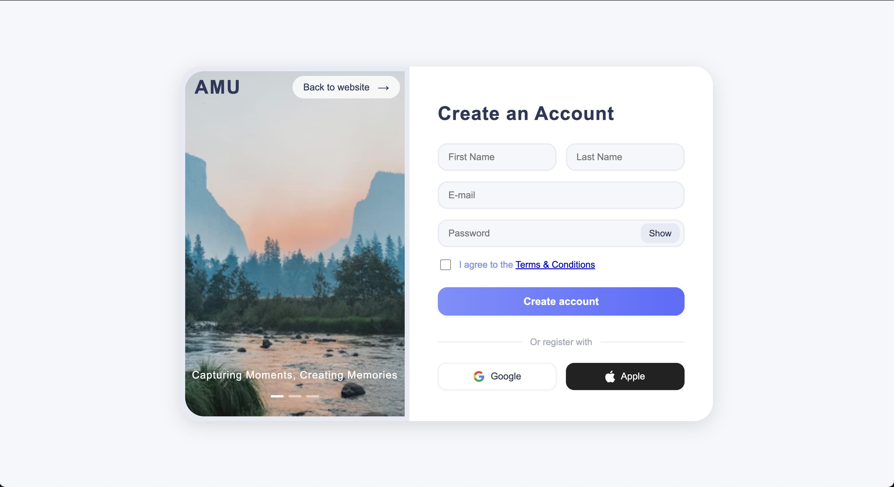

# Tutoriel : Créer une page de Signup élégante en HTML & CSS (BEM)

Ce tutoriel vous guide pas à pas pour réaliser une page d'inscription moderne, responsive et professionnelle, en utilisant HTML/CSS et la méthodologie BEM pour organiser vos classes.

---

## 1. Préparer la structure du projet

Dans le dossier `assets/ui-design`, vous trouverez des fichiers d'illustration (captures d'écran ou maquettes) qui représentent le rendu visuel attendu de la page signup.

- **À quoi servent ces fichiers ?**
  - Ils servent de référence visuelle pour comparer votre travail au design cible.
  - Ouvrez-les simplement avec votre visionneuse d'images pour voir l'apparence attendue sur desktop et mobile.

- **Exemples de fichiers :**
  - `sign-up-desktop.png` : rendu attendu sur ordinateur.
  - `sign-up-mobile.png` : rendu attendu sur mobile.

Aperçu des maquettes :




> Comparez régulièrement votre page à ces images pour obtenir un résultat fidèle à la maquette !

Créez une arborescence comme suit :

```
signup-atrm/
│
├── assets/
│   └── img/
│       ├── google-logo.svg
│       └── apple-logo.svg
├── signup.html
├── style.css
└── TUTORIEL_SIGNUP.md
```

---

## 2. Créer le fichier HTML de base

Créez `signup.html` avec la structure suivante :

```html
<!DOCTYPE html>
<html lang="en">
<head>
    <meta charset="UTF-8" />
    <meta name="viewport" content="width=device-width, initial-scale=1.0" />
    <title>Signup - AMU</title>
    <link rel="stylesheet" href="style.css" />
</head>
<body>
    <div class="signup">
        <div class="signup__card">
            <!-- Partie Gauche -->
            <div class="signup__card-left">
                <div class="signup__card-left-header">
                    <span class="signup__amu-title">AMU</span>
                    <button class="signup__back-btn">
                        Back to website <span class="signup__arrow">→</span>
                    </button>
                </div>
                <div class="signup__image-bg"></div>
                <div class="signup__card-left-footer">
                    <div class="signup__carousel-text">
                        <span class="signup__carousel-item signup__carousel-item--active">Capturing Moments, Creating Memories</span>
                        <span class="signup__carousel-item">Share Your Story, Inspire Others</span>
                        <span class="signup__carousel-item">Join Our Community Today</span>
                    </div>
                    <div class="signup__carousel-indicators">
                        <span class="signup__carousel-indicator signup__carousel-indicator--active"></span>
                        <span class="signup__carousel-indicator"></span>
                        <span class="signup__carousel-indicator"></span>
                    </div>
                </div>
            </div>
            <!-- Partie Droite -->
            <div class="signup__card-right">
                <h2 class="signup__title">Create an Account</h2>
                <form class="signup__form">
                    <div class="signup__form-row">
                        <input type="text" placeholder="First Name" name="firstname" class="signup__input" required />
                        <input type="text" placeholder="Last Name" name="lastname" class="signup__input" required />
                    </div>
                    <input type="email" placeholder="E-mail" name="email" class="signup__input" required />
                    <div class="signup__password-row signup__password-group">
                        <input type="password" placeholder="Password" name="password" id="password" class="signup__input" required />
                        <button type="button" class="signup__toggle-password" onclick="togglePassword()">Show</button>
                    </div>
                    <div class="signup__checkbox-row">
                        <input type="checkbox" id="terms" name="terms" class="signup__checkbox" required />
                        <label for="terms" class="signup__checkbox-label">I agree to the <a href="#">Terms & Conditions</a></label>
                    </div>
                    <button type="submit" class="signup__create-account-btn">Create account</button>
                    <div class="signup__divider">
                        <span class="signup__line"></span>
                        <span class="signup__or">Or register with</span>
                        <span class="signup__line"></span>
                    </div>
                    <div class="signup__social-row">
                        <button type="button" class="signup__social-btn signup__social-btn--google">
                            
                            Google
                        </button>
                        <button type="button" class="signup__social-btn signup__social-btn--apple">
                            
                            Apple
                        </button>
                    </div>
                </form>
            </div>
        </div>
    </div>
    <script src="signup.js"></script>
</body>
</html>
```

---

## 3. Ajouter le fichier JavaScript (signup.js)

Créez un fichier `signup.js` à la racine du projet :

```js
// signup.js : Gère l'affichage/masquage du mot de passe et le carrousel de texte

// Password toggle
function togglePassword() {
    const pwd = document.getElementById('password');
    const btn = document.querySelector('.signup__toggle-password');
    if (pwd.type === 'password') {
        pwd.type = 'text';
        btn.textContent = 'Hide';
    } else {
        pwd.type = 'password';
        btn.textContent = 'Show';
    }
}

// Carousel logic
let carouselIndex = 0;
const items = document.querySelectorAll('.signup__carousel-item');
const indicators = document.querySelectorAll('.signup__carousel-indicator');
if (items.length && indicators.length) {
    setInterval(() => {
        items[carouselIndex].classList.remove('signup__carousel-item--active');
        indicators[carouselIndex].classList.remove('signup__carousel-indicator--active');
        carouselIndex = (carouselIndex + 1) % items.length;
        items[carouselIndex].classList.add('signup__carousel-item--active');
        indicators[carouselIndex].classList.add('signup__carousel-indicator--active');
    }, 3000);
}
```

Ajoutez bien la ligne suivante dans votre HTML juste avant `</body>` :

```html
<script src="signup.js"></script>
```

---

## 3. Créer le style CSS (BEM)

Créez un fichier `style.css` et ajoutez-y les styles suivants :

```css
body {
    margin: 0;
    padding: 0;
    font-family: 'Segoe UI', Arial, sans-serif;
    background: #f5f7fa;
    min-height: 100vh;
    display: flex;
    justify-content: center;
    align-items: center;
}

.signup {
    width: 100vw;
    height: 100vh;
    display: flex;
    justify-content: center;
    align-items: center;
}

.signup__card {
    display: flex;
    flex-direction: row;
    width: 900px;
    height: 600px;
    background: #fff;
    border-radius: 32px;
    box-shadow: 0 8px 32px rgba(0,0,0,0.12);
    overflow: hidden;
}

/* ... (voir le code complet dans le projet pour tous les blocs, éléments et modificateurs BEM) ... */
```

**Astuce** : Pour chaque bloc/élément, gardez la logique :
- `.signup__block` pour un bloc principal
- `.signup__block-element` pour un élément interne
- `.signup__block-element--modifier` pour une variante

---

## 4. Ajouter les logos Google et Apple

Placez les fichiers SVG `google-logo.svg` et `apple-logo.svg` dans `assets/img/`.

Dans le HTML, utilisez :
```html


```

---

## 5. Responsive et expérience mobile

Le design s’adapte automatiquement grâce aux media queries :
- Sur mobile, seule la partie formulaire s’affiche, centrée et bien lisible.
- La card garde une marge pour ne pas coller aux bords de l’écran.

---

## 6. Points importants BEM

- **Nommez toutes vos classes selon la convention** : `block__element--modifier`.
- Ne mélangez pas les underscores et tirets ailleurs que pour BEM.
- Gardez la structure HTML et CSS cohérente.

---

## 7. Résultat attendu

Vous obtenez une page d’inscription professionnelle, élégante, responsive, facile à maintenir et à faire évoluer.

---

## 8. Pour aller plus loin
- Ajoutez des validations JS ou un backend.
- Ajoutez des animations CSS.
- Personnalisez les couleurs ou le texte.

---

**Bravo, vous avez créé une page de signup moderne avec BEM !**
