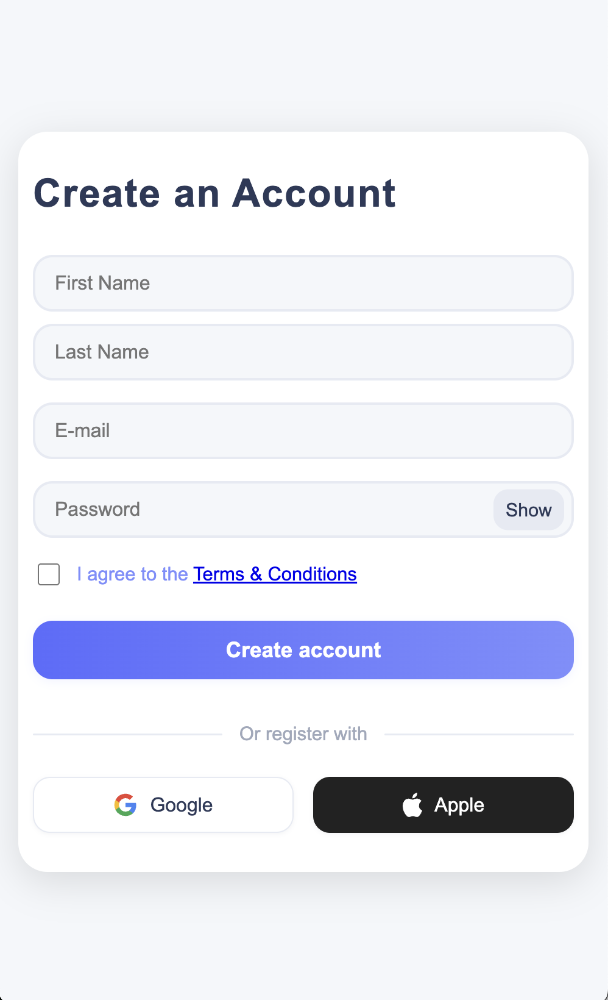

# Tutoriel : Créer une page de Signup élégante en HTML & CSS (BEM)

Ce tutoriel te guide pas à pas pour réaliser une page d'inscription moderne, responsive et professionnelle, en utilisant HTML/CSS et la méthodologie BEM pour organiser tes classes.

---

## 1. Préparer la structure du projet

Dans le dossier `assets/ui-design`, tu trouveras des fichiers d'illustration (captures d'écran ou maquettes) qui représentent le rendu visuel attendu de la page signup.

---

## 2. Architecture de page : comment bien découper le contenu

Avant d'écrire du code, il est important de réfléchir à la façon dont tu vas organiser les différentes parties de ta page. C'est comme dessiner le plan d'une maison avant de la construire.

- Pour que le code soit plus clair, facile à lire et à modifier.
- Pour pouvoir réutiliser certaines parties (par exemple, un bouton ou un formulaire).
- Pour séparer ce qui a des rôles différents (titre, image, formulaire, etc.).

**Comment faire concrètement ?**

Imagine ta page comme une grande boîte (le "conteneur principal"). À l'intérieur, tu places d'autres boîtes :

- Une boîte pour l'en-tête (logo, titre, bouton retour)
- Une boîte pour l'image ou l'illustration
- Une boîte pour le formulaire d'inscription
- Une boîte pour les messages ou slogans

**Exemple pour la page Signup :**

- Un conteneur principal `.signup`
  - Une carte `.signup__card` qui regroupe tout
    - Partie gauche `.signup__card-left` : logo, bouton retour, image, slogans
    - Partie droite `.signup__card-right` : formulaire avec les champs à remplir

**Schéma simplifié :**

```text
.signup
│
├── .signup__card
│   ├── .signup__card-left   (logo, image, slogans)
│   └── .signup__card-right  (formulaire)
```

**Astuce :**

Découper la page en "blocs" aide aussi à bien nommer tes classes CSS (méthode BEM) et à styliser chaque partie facilement.

---

- **À quoi servent ces fichiers ?**

- Ils servent de référence visuelle pour comparer ton travail au design cible.
- Ouvre-les simplement avec ta visionneuse d'images pour voir l'apparence attendue sur desktop et mobile.

- **Exemples de fichiers :**
- `sign-up-desktop.png` : rendu attendu sur ordinateur.
- `sign-up-mobile.png` : rendu attendu sur mobile.

Aperçu des maquettes :




> Comparez régulièrement votre page à ces images pour obtenir un résultat fidèle à la maquette !

Crée une arborescence comme suit :

```text
signup-form/
│   ├── assets/
│   │   ├── img/
│   │   │   ├── apple-logo.svg
│   │   │   └── google-logo.svg
│   │   └── ui-design/
│   │       ├── sign-up-desktop.png
│   │       └── sign-up-mobile.png
│   ├── index.html
│   ├── scripts/
│   │   └── signup.js
│   └── styles/
│       └── style.css
```

---

## 2. Créer le fichier HTML de base

Créez `index.html` avec la structure suivante :

```html
<!DOCTYPE html>
<html lang="en">
  <head>
    <meta charset="UTF-8" />
    <meta name="viewport" content="width=device-width, initial-scale=1.0" />
    <title>Signup - AMU</title>
    <link rel="stylesheet" href="styles/style.css" />
  </head>
  <body>
    <div class="signup">
      <div class="signup__card">
        <!-- Partie Gauche -->
        <div class="signup__card-left">
          <div class="signup__card-left-header">
            <span class="signup__amu-title">AMU</span>
            <button class="signup__back-btn">
              Back to website <span class="signup__arrow">→</span>
            </button>
          </div>
          <div class="signup__image-bg"></div>
          <div class="signup__card-left-footer">
            <div class="signup__carousel-text">
              <span class="signup__carousel-item signup__carousel-item--active"
                >Capturing Moments, Creating Memories</span
              >
              <span class="signup__carousel-item"
                >Share Your Story, Inspire Others</span
              >
              <span class="signup__carousel-item"
                >Join Our Community Today</span
              >
            </div>
            <div class="signup__carousel-indicators">
              <span
                class="signup__carousel-indicator signup__carousel-indicator--active"
              ></span>
              <span class="signup__carousel-indicator"></span>
              <span class="signup__carousel-indicator"></span>
            </div>
          </div>
        </div>
        <!-- Partie Droite -->
        <div class="signup__card-right">
          <h2 class="signup__title">Create an Account</h2>
          <form class="signup__form">
            <div class="signup__form-row">
              <input
                type="text"
                placeholder="First Name"
                name="firstname"
                class="signup__input"
                required
              />
              <input
                type="text"
                placeholder="Last Name"
                name="lastname"
                class="signup__input"
                required
              />
            </div>
            <input
              type="email"
              placeholder="E-mail"
              name="email"
              class="signup__input"
              required
            />
            <div class="signup__password-row signup__password-group">
              <input
                type="password"
                placeholder="Password"
                name="password"
                id="password"
                class="signup__input"
                required
              />
              <button
                type="button"
                class="signup__toggle-password"
                onclick="togglePassword()"
              >
                Show
              </button>
            </div>
            <div class="signup__checkbox-row">
              <input
                type="checkbox"
                id="terms"
                name="terms"
                class="signup__checkbox"
                required
              />
              <label for="terms" class="signup__checkbox-label"
                >I agree to the <a href="#">Terms & Conditions</a></label
              >
            </div>
            <button type="submit" class="signup__create-account-btn">
              Create account
            </button>
            <div class="signup__divider">
              <span class="signup__line"></span>
              <span class="signup__or">Or register with</span>
              <span class="signup__line"></span>
            </div>
            <div class="signup__social-row">
              <button
                type="button"
                class="signup__social-btn signup__social-btn--google"
              >
                
                Google
              </button>
              <button
                type="button"
                class="signup__social-btn signup__social-btn--apple"
              >
                
                Apple
              </button>
            </div>
          </form>
        </div>
      </div>
    </div>
    <script src="scripts/signup.js"></script>
  </body>
</html>
```

---

## 3. Ajouter le fichier JavaScript (signup.js)

Créez un fichier `signup.js` à la racine du projet :

```js
// signup.js : Gère l'affichage/masquage du mot de passe et le carrousel de texte

/**
 * Affiche ou masque le mot de passe lors du clic sur l'icône ou le bouton.
 * Change dynamiquement le type de l'input et le texte du bouton.
 */
function togglePassword() {
  const pwd = document.getElementById("password");
  const btn = document.querySelector(".signup__toggle-password");
  if (pwd.type === "password") {
    pwd.type = "text";
    btn.textContent = "Hide";
  } else {
    pwd.type = "password";
    btn.textContent = "Show";
  }
}

// --- Carrousel de texte en bas de la partie gauche ---
// Fait défiler automatiquement les slogans toutes les 3 secondes
let carouselIndex = 0;
const items = document.querySelectorAll(".signup__carousel-item");
const indicators = document.querySelectorAll(".signup__carousel-indicator");

// On ne lance le carrousel que s'il y a au moins un slogan et un indicateur
if (items.length && indicators.length) {
  setInterval(() => {
    // On retire la classe active de l'ancien slogan et indicateur
    items[carouselIndex].classList.remove("signup__carousel-item--active");
    indicators[carouselIndex].classList.remove(
      "signup__carousel-indicator--active"
    );
    // On passe à l'élément suivant (bouclage avec modulo)
    carouselIndex = (carouselIndex + 1) % items.length;
    // On ajoute la classe active au nouveau slogan et indicateur
    items[carouselIndex].classList.add("signup__carousel-item--active");
    indicators[carouselIndex].classList.add(
      "signup__carousel-indicator--active"
    );
  }, 3000); // 3000 ms = 3 secondes
}
```

Ajoutez bien la ligne suivante dans votre HTML juste avant `</body>` :

```html
<script src="signup.js"></script>
```

---

## 3. Créer le style CSS (BEM)

Créez un fichier `style.css` et ajoutez-y les styles suivants :

```css
/* Reset & Base */
/*
  Feuille de style principale pour la page de signup.
  Convention BEM utilisée pour nommer les classes.
  Chaque bloc, élément et modificateur est clairement séparé.
*/

/* --- RESET & BASE --- */
body {
  margin: 0;
  padding: 0;
  font-family: "Segoe UI", Arial, sans-serif;
  background: #f5f7fa; /* Couleur de fond douce */
  min-height: 100vh;
  display: flex; /* Centre le contenu verticalement et horizontalement */
  justify-content: center;
  align-items: center;
}

/* --- CONTAINER PRINCIPAL --- */
.signup {
  width: 100vw;
  height: 100vh;
  display: flex;
  justify-content: center;
  align-items: center;
}

/* --- CARD PRINCIPALE (contient la partie gauche et droite) --- */
.signup__card {
  display: flex;
  flex-direction: row;
  width: 900px;
  height: 600px;
  background: #fff;
  border-radius: 32px; /* Bords arrondis */
  box-shadow: 0 8px 32px rgba(0, 0, 0, 0.12); /* Ombre douce */
  overflow: hidden;
}

/* ... (voir le code complet dans le projet pour tous les blocs, éléments et modificateurs BEM) ... */
```

**Astuce** : Pour chaque bloc/élément, gardez la logique :

- `.signup__block` pour un bloc principal
- `.signup__block-element` pour un élément interne
- `.signup__block-element--modifier` pour une variante

---

## 4. Ajouter les logos Google et Apple

Placez les fichiers SVG `google-logo.svg` et `apple-logo.svg` dans `assets/img/`.

Dans le HTML, utilisez :

```html


```

---

## 5. Responsive et expérience mobile

Le design s’adapte automatiquement grâce aux media queries :

```css
@media (max-width: 600px) {
  .signup__card {
    flex-direction: column;
    width: 100vw;
    height: auto;
    min-height: 100vh;
    border-radius: 0;
    box-shadow: none;
  }
  .signup__card-left {
    display: none; /* On masque la partie gauche sur mobile */
  }
  .signup__card-right {
    width: 100vw;
    min-height: 100vh;
    justify-content: center;
    align-items: center;
    padding: 32px 8px;
  }
}
```

Ce code CSS permet d'adapter l'affichage du formulaire pour une expérience optimale sur mobile : la partie gauche disparaît, le formulaire s'affiche en grand, et tout reste lisible et confortable.

- Sur mobile, seule la partie formulaire s’affiche, centrée et bien lisible.
- La card garde une marge pour ne pas coller aux bords de l’écran.

---

## 6. Points importants BEM

- **Nomme toutes tes classes selon la convention** : `block__element--modifier`.
- Ne mélange pas les underscores et tirets ailleurs que pour BEM.
- Garde la structure HTML et CSS cohérente.

---

## 7. Résultat attendu

Tu obtiens une page d’inscription professionnelle, élégante, responsive, facile à maintenir et à faire évoluer.

---

## 8. Pour aller plus loin

- Ajoute des validations JS ou un backend.
- Ajoute des animations CSS.
- Personnalise les couleurs ou le texte.

---

**Bravo, tu as créé une page de signup moderne avec BEM !**
